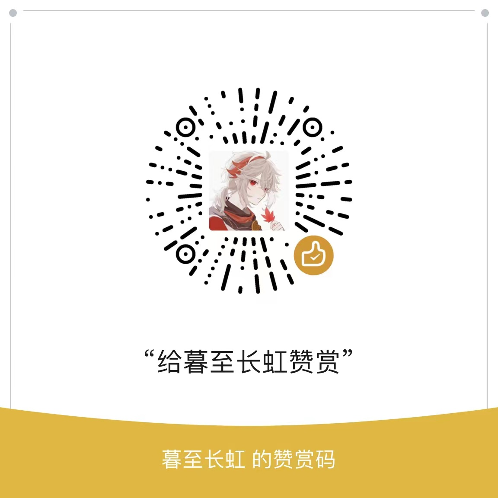

# Doghead OS

#### Introduction
Dog Head OS entertainment operating system (Dog Head OS), is Xiaoqing big yy Dog head OS development team based on PPT+ (.ppsx show) kernel entertainment operating system (the future may consider using C, easy language or Java to edit), I hope you give a lot of tips, support us, thank you!

#### download
See the Wiki for details.

#### installation tutorial

1. Download the.ppsx file
2. Double-click the file to open it

#### Open source notes

1. Change the file suffix to.ppt to edit it
2. Must be noted © Xiaoqing Dada yy & blue block, all rights reserved
3. External distribution must be approved by Xiaoqingda yy and Xiaoqingda yy Doghead OS development team
4. XiaoQing greatly yy FanBook official BBS invite url: https://fanbook.mobi/NMNGMFG8

#### One More Thing...
A completely new system written in C...... is currently under consideration
If you are willing (volunteer), you can come and join us!
Stay tuned!