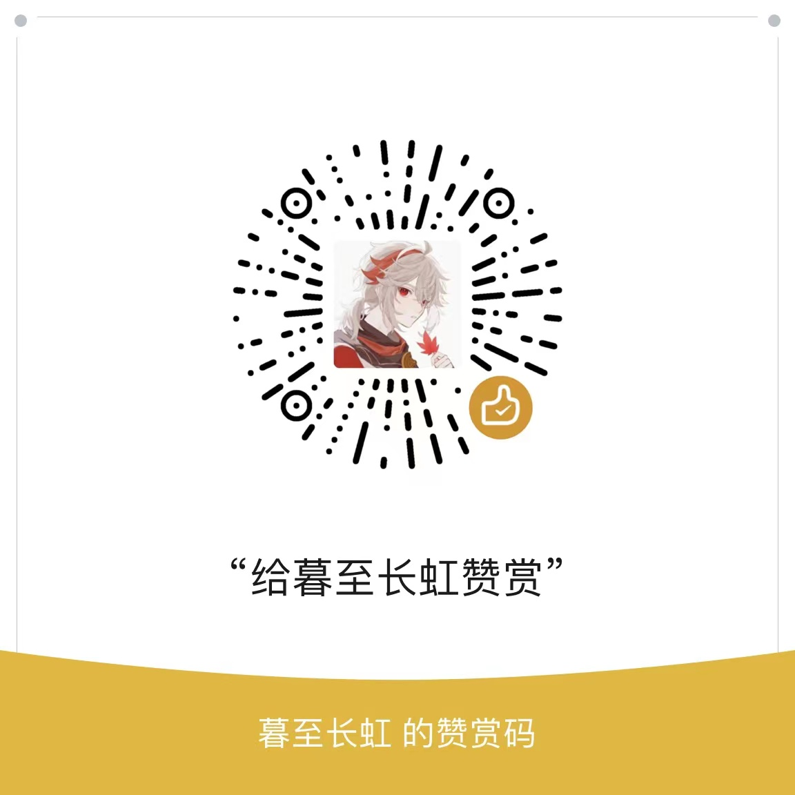

# 狗头OS（DogHead OS）
### P系列

#### 介绍
狗头OS娱乐操作系统（DogHead OS），是晓青大大yy狗头OS开发团队基于PPT+（.ppsx放映）内核的娱乐操作系统（未来可能会考虑使用C、易语言或Java进行编辑），与晓青大大yy无直接关系。希望大家多多打赏，支持我们，谢谢！

#### 下载
从发行版（release）中进行下载。
目前的最新版本是P31.0。

#### 安装教程

1.  下载.ppsx文件
2.  双击打开文件

#### 开源说明

1.  把此文件后缀改为.ppt即可进行编辑（您应只对开源版本进行更改）
2.  必须注有©晓青大大yy & blue block，保留一切权利
3.  对外发行必须经过晓青大大yy、晓青大大yy狗头OS开发团队的许可
4.  晓青大大yy FanBook官方论坛邀请网址：https://fanbook.mobi/NMNGMFG8

### One More Thing...
最近正在考虑用C语言编写一个全新的系统......
如果您有意愿（自愿），可以来加入我们！
敬请期待！

